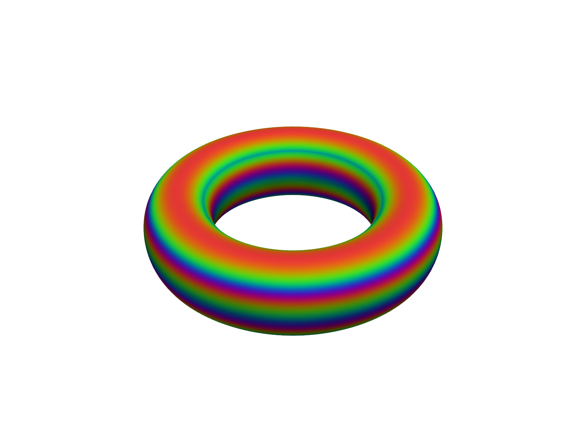
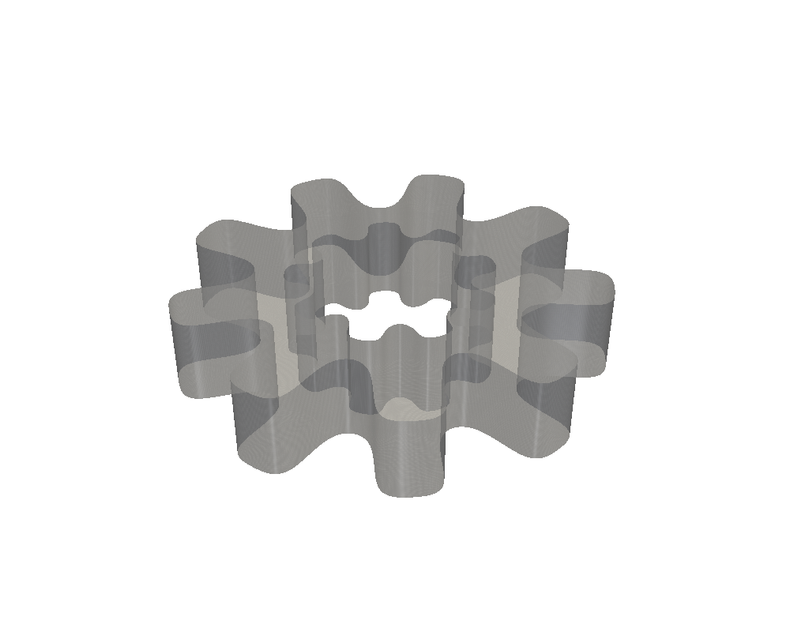
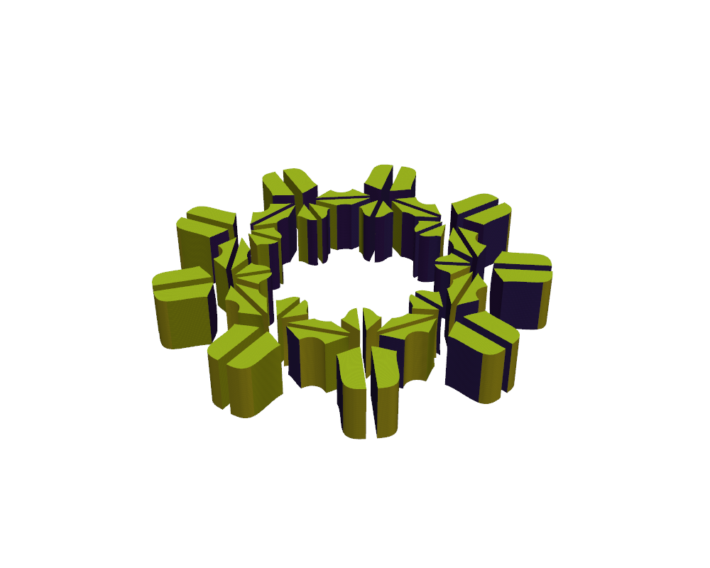
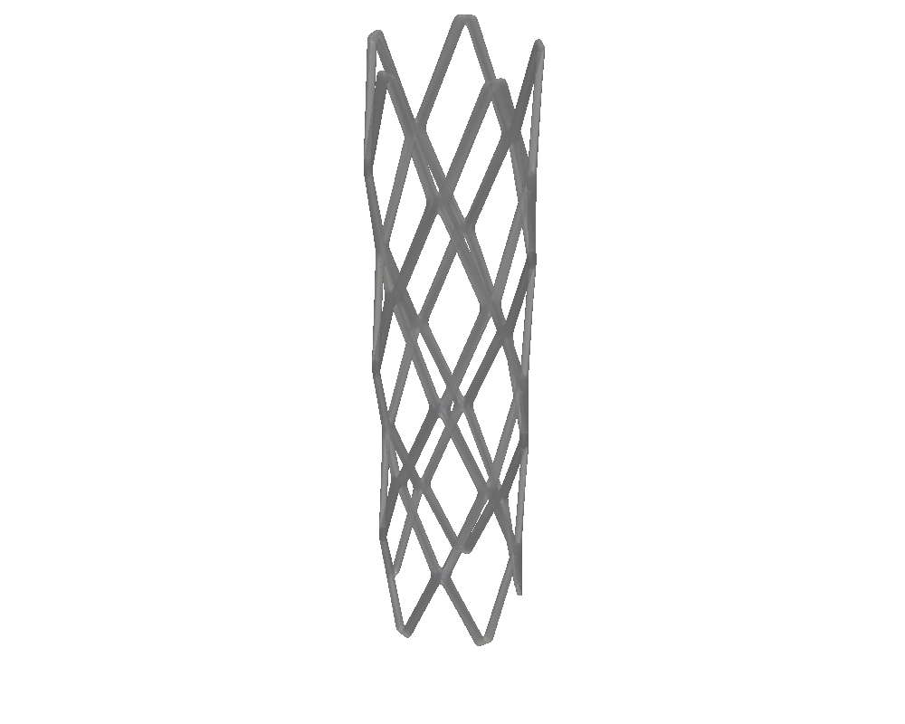

# pyHexNURBS-IGA

A Python toolkit for **solid NURBS conforming scaffolding** and
**isogeometric analysis (IGA)** of hexahedral N-junction geometries — e.g.
branching tube networks such as vascular/airway trees or engineered
lattices — built on top of an original NURBS/B-spline kernel with an
optional C accelerator.

It implements the geometric scaffolding approach described in:

> S. Moriconi, P. Nachev, S. Ourselin, M. J. Cardoso,
> *"Solid NURBS Conforming Scaffolding for Isogeometric Analysis"*,
> [arXiv:2206.04421](https://arxiv.org/abs/2206.04421).

## ⚠️ Work in progress

This is a **work-in-progress** toolkit: the NURBS geometry core and the
N-junction scaffolding/smoothing pipeline are functional and tested, but
several capabilities are still incomplete or only partially validated —
in particular around edge cases of the smoothing pipeline and the
downstream IGA solvers' visualisation/export path. Treat results as
provisional. See [Known limitations](#known-limitations) below.

## Gallery

| | |
|---|---|
|  |  |
|  |  |

## Walkthroughs

| App | Video |
|---|---|
| `app_demo.py` — synthetic CAD demos | <https://youtu.be/a_YRhu8yNG4> |
| `app_njunction.py` — N-junction scaffold generator | <https://youtu.be/Qbg5CgDZOmA> |
| `app_sim.py` — IGA simulation viewer | <https://youtu.be/P5CfYeLZwVM> |

## What's inside

* **`hexiga.nurbs`** — a from-scratch NURBS/B-spline geometry core
  (curves, surfaces, volumes; evaluation, derivatives, knot insertion,
  degree elevation, multipatch interfaces, `.txt` I/O), with an optional
  original C accelerator (see `hexiga/nurbs/_c/README.md`) for the
  performance-critical kernels.
* **`hexiga.junc` / `hexiga.scaff` / `hexiga.smth`** — N-junction
  scaffold construction: quad-face topology, hexahedral subdivision,
  and Taubin-style control-point smoothing.
* **`hexiga.iga`** — isogeometric finite-element assembly and solvers
  (fluid / elasticity / Maxwell eigenproblems) over multipatch B-spline
  spaces.
* **`hexiga.viz`** — PyVista-based 3D plotting of the generated
  scaffolds.
* **`hexiga.gui`** — three Tk desktop apps (`app_demo`, `app_njunction`,
  `app_sim`) tying the pipeline together interactively.

## Install

```bash
git clone https://github.com/stefanomoriconi/pyHexNURBS-IGA.git
cd pyHexNURBS-IGA
python -m venv .venv && source .venv/bin/activate
pip install -e ".[dev]"
```

## Quickstart

```python
from hexiga.demo.demo_torus import demoTorus

geometry = demoTorus()  # returns a multipatch NURBS scaffold (list[Nrb])
```

Or launch a GUI app:

```bash
python -m hexiga.gui.app_njunction
```

## Optional C accelerator

The pure-NumPy NURBS kernels are the default and the deterministic
reference used by the test suite. An optional, original C implementation
of the same kernels (OpenMP-parallelized) can be built for a speed-up on
batched evaluation:

```bash
bash hexiga/nurbs/_c/build.sh
export HEXIGA_BACKEND=nurbs_c
```

See `hexiga/nurbs/_c/README.md` for details.

## Known limitations

* Mixed-I/O capped-tube smoothing: when exactly one tube in a junction is
  capped and the rest are open, the cap's face association is not always
  resolved correctly by the smoothing pass (workaround: enable "Include
  Wall").
* `app_sim` does not yet offer an interactive 3D boundary-condition editor,
  nor a VTK/Paraview export of numeric simulation results.
* Post-simulation visualisation of solved fields is not yet wired up.
* Full visual parity with the walkthrough videos above has not been
  exhaustively re-verified on every demo geometry.

## Testing

```bash
python -m unittest discover -s tests
```

## License

Creative Commons Attribution-NonCommercial 4.0 International (CC BY-NC
4.0) — free for research and non-commercial use; see [LICENSE](LICENSE).
For commercial licensing, please contact the author.
